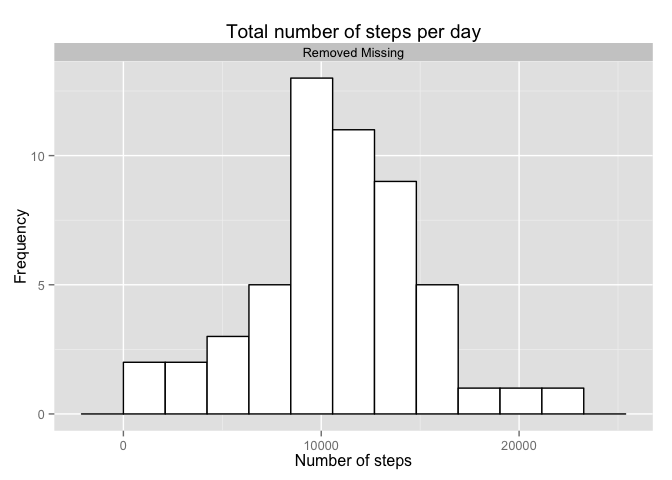
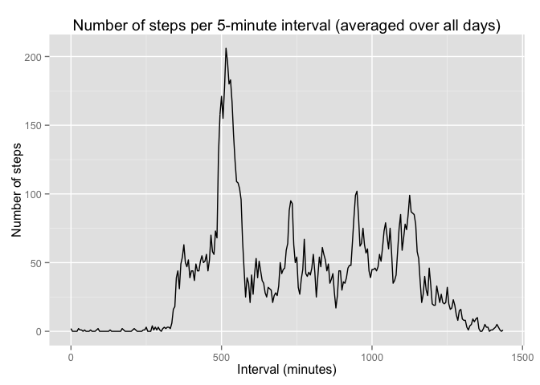
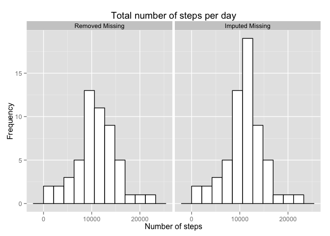
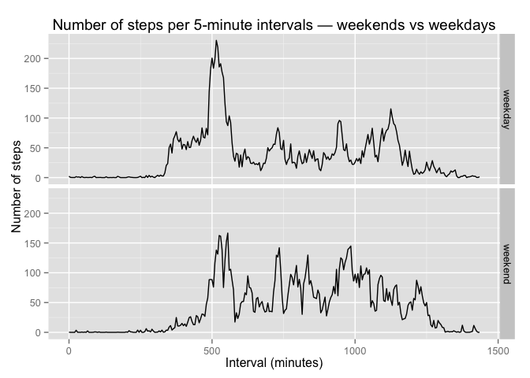
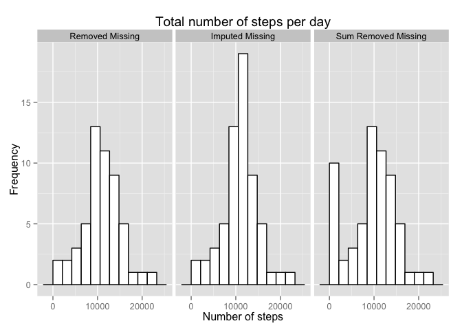

# Reproducible Research: Peer Assessment 1


## Loading and preprocessing the data

In this section, we unzip the activity csv file and then read it.
We use the first chunk to load all needed libraries. We also use it to 
change the interval from hhmm integer format into minutes, so that 
it scale from 0 minutes to 1435 minutes, instead of the non-continuous 
0 to 2455 range (read the note below).

**Important Note:** The interval variable from the csv file is an integer 
value which codes the elapsed hours and minutes of the day in the format:
hhmm. In other words, the 2 right-most digits represent the minutes, 
and the 2 left-most digits represent the hours of the day. 
For example, the first 12 entries run from 0 minutes to 55 minutes
with a step of 5 minutes. But the 13'th entry is 100, standing for 1:00.
It then runs again up to 155 and then change to 200 for 2:00, and so on.
This small change in the representation of the interval has no impact on any
of the conclusions, it just makes the line plots smoother (yet the general
shape stay the same). Rigorously speaking, this change is mandatory
otherwise we would have used a non-continuous variable (the interval
as they are in the csv file) as a continuous one, and this is plainly
wrong.


```r
library(lubridate)
library(dplyr)
library(ggplot2)
library(knitr)
activity_filename <- unzip("activity.zip")
activity <- read.csv(activity_filename)
# The function itv2min() takes an integer interval in the format hhmm
# and returns the corresponding number of minutes (hh*60 + mm).
itv2min <- function(x) { (x %/% 100) * 60 + x %% 100 }
activity <- mutate(activity, interval = itv2min(interval))
```


## What is mean total number of steps taken per day?

In this section we compute the total number of steps per day after removing
all missing values. (We refer to this summary as **Removed Missing**.) 
We then plot a histogram of the total steps per day.
Finally, we compute and report the mean and median values.

**Note:** All missing values are spread over 8 full days. If we want to
ignore missing values, we must then ignore these days, simply because the
sum of steps for these days should return a missing value too.
We hence choose to filter out all missing values ahead of processing so that
days with only missing values are discarded. It wouldn't be the case if we
would instead remove them in the call to the function `sum(..., na.rm = TRUE)`. 
This function initiatializes the sum to zero before adding non-missing values.
Hence, days with only missing values would have a sum of zero instead of
being discarded. It would artificially boost the frequency of the first
bar of the histogram and would artificially drag down the mean and median
values.


```r
# filter out missing values, then group by date and sum
activity.day <- filter(activity, !is.na(steps)) %>% group_by(date) %>% summarize(steps = sum(steps))
# fixing binwidth to look like basic hist function (reused for all histogram)
binWidth <- diff(range(activity.day$steps))/10
# activity.day.all and facets will become more meaningful in future histograms
# we use them here for style consitency among histograms
activity.day.all <- cbind(Analysis = rep("Removed Missing", dim(activity.day)[1]), activity.day)
g <- ggplot(activity.day.all, aes(x=steps))
g <- g + geom_histogram(binwidth = binWidth, fill="white", colour="black") 
g <- g + facet_grid(. ~ Analysis)
g <- g + xlab("Number of steps") + ylab("Frequency")
g + ggtitle("Total number of steps per day")
```

 

The following chunk is used to compute the mean and median values and present
them into a table.


```r
mean_steps <- as.integer(mean(activity.day$steps))
median_steps <- median(activity.day$steps)
# We present these values in a table for style consitency with future results.
comp_data <- data_frame(c(mean_steps, median_steps))
names(comp_data) <- c("Removed Missing")
row.names(comp_data) <- c("Mean total steps per day", "Median total steps per day")
kable(comp_data, "markdown", caption = "Mean and median values of the total steps per day (averaged over all days) computed with the Removed Missing summary")
```


|                           | Removed Missing|
|:--------------------------|---------------:|
|Mean total steps per day   |           10766|
|Median total steps per day |           10765|


## What is the average daily activity pattern?

In this section we plot the average (over all days) number of steps per 5 minute
intervals after removing missing values (like **Removed Missing** summary). 
We also compute the maximum value of this average and report the corresponding
interval.


```r
# filter out missing values, group by interval then summarize with the mean
activity.interval <- filter(activity, !is.na(steps)) %>% group_by(interval) %>%
        summarize(steps = as.integer(round(mean(steps))))
g <- ggplot(activity.interval, aes(x=interval,y=steps)) + geom_line()
g <- g + xlab("Interval (minutes)") + ylab("Number of steps") 
g + ggtitle("Number of steps per 5-minute interval (averaged over all days)")
```

 

We can see a peak of activity aroun 500 minutes (i.e. around 08:20).
Let's find out exactly when this peak occurs.

The following chunk computes the maximum value of the average number of steps
per 5-minute interval as well as the interval for which this maximum value 
occurs.


```r
max_steps_interval <- max(activity.interval$steps)
max_interval <- activity.interval$interval[activity.interval$steps == max_steps_interval]
max_int_str <- format(ymd("2015-12-11") + minutes(max_interval), "%H:%M")
```

The maximum number of steps during the day (=206) occurs 
within the interval 515 minutes (i.e. around 08:35).


## Imputing missing values

In this section we calculate and report the total number of missing values
in the dataset. **[Strategy]**: we then replace these missing values with the
average value (over all days) for the corresponding interval. We use this
new dataset to make a histogram of the total number of steps taken each day,
and we calculate the mean and median and compare the result to our previous
estimation. We will refer to this summary as **Imputed Missing**.

Let's first compute the number of missing values as well as its ratio to
the total number of observations.

```r
nb_miss <- sum(is.na(activity$steps))
nb_obs <- dim(activity)[1]
miss_perc <- round(nb_miss / nb_obs * 100, 2)
```
The dataset contains 2304 missing values, which counts for
13.11% of the observables.

The following chunk creates a new dataset into which the missing values 
are imputed with the average value (over all days) of the corresponding 
5-minute interval.


```r
# TODO: replace by a function + mutate
activity2 <- activity
for (i in 1:nb_obs) {
        if (is.na(activity$steps[i])) {
                activity2$steps[i] = activity.interval$steps[activity.interval$interval == activity$interval[i]]
        }
}
```


We can now make a histogram of the total number of steps per day with the 
fixed dataset. We plot this histogram (**Imputed Missing**) side by side 
with the previous one (**Removed Missing**) to facilitate comparison.

```r
# group by date and summarize with sum
activity.day2 <- group_by(activity2, date) %>% summarize(steps = sum(steps))
# Let's add this to activity.day.all and display them in facets 
activity.day.all <- rbind(activity.day.all,
                          cbind(Analysis = rep("Imputed Missing", dim(activity.day2)[1]),
                                activity.day2))
g <- ggplot(activity.day.all, aes(x=steps))
g <- g + geom_histogram(binwidth = binWidth, fill="white", colour="black") 
g <- g + facet_grid(. ~ Analysis)
g <- g + xlab("Number of steps") + ylab("Frequency")
g + ggtitle("Total number of steps per day")
```

 

As we can see, they both roughly have the same shape. Only the middle bar are
differents. The **Imputed Missing** histogram has 8 more counts compare to the
**Removed Missing** histogram. It is a direct effect of imputing the 8 
missing-values days by the average value of the correponding 5-minute intervals
(the sum leading to the average number of steps per days: roughly represented
by the middle bar in the histogram). Let's see how the mean and median values
are affected.

The following chunk is used to compute the mean and median of the total number
of steps per day for the **Imputed Missing** summary. It then present this
values in a table next to the results of the **Removed Missing** summary.


```r
mean_steps2 <- as.integer(mean(activity.day2$steps))
median_steps2 <- median(activity.day2$steps)

comp_data <- cbind(comp_data, c(mean_steps2, median_steps2))
colnames(comp_data)[2] <- "Imputed Missing"
kable(comp_data, "markdown", caption = "Mean and median values of the total steps per day (averaged over all days) — Comparing results from the Removed Missing values summary to the ones from the Imputed Missing values summary")
```


|                           | Removed Missing| Imputed Missing|
|:--------------------------|---------------:|---------------:|
|Mean total steps per day   |           10766|           10765|
|Median total steps per day |           10765|           10762|

We observe a tiny difference between the two approaches, confirming 
that removing the missing values before computing the total
number of steps per day leads to results comparable to the ones obtained
by imputing the missing values. (Go to the Bonus section at the end to
see how our results compare if we would have removed the missing values
with `sum(..., na.rm = TRUE)`.)


## Are there differences in activity patterns between weekdays and weekends?

In this section we add a new factor variable ditinguishing weekdays from
weekends. We then compute the average number of steps per 5-minute interval
(separately averaged over weekdays and weekend days). Finally we
plot the averaged number of steps per 5 minutes intervals for weekdays
and weekends. For comparison, they are displayed one on top of the other.


```r
# add a factor (day_type) for weekdays and weekends
activity2 <- mutate(activity2, day_type = factor(wday(ymd(date)) == 1 | wday(ymd(date)) == 7,
                                                 labels = c("weekday", "weekend")))
# group by day_type and interval, and then summarize with the mean
activity.day_type <- group_by(activity2, day_type, interval) %>% summarize(steps = mean(steps))
g <- ggplot(activity.day_type, aes(x=interval, y=steps))
g <- g + geom_line() + facet_grid(day_type ~ .)
g <- g + xlab("Interval (minutes)") + ylab("Number of steps")
g + ggtitle("Number of steps per 5-minute intervals — weekends vs weekdays")
```

 

We can see that during the week, there is an importan peak of activity in the 
morning and it then settled down during the day with smaller peaks at different
time of the day. The final peak is around 20:00, probably reflecting the 
coach potatoe habit of watching TV before going to bed.

The weekend start slower and has a less intense peak in the morning. The rest
of day is far more animated than during the week (probably reflecting the
forced sedentariness of the job during weekdays), but it slow down around
21:00 (coach potatoe and sleep).


## Bonus: What if we use sum(..., na.rm = TRUE)?

Just for fun, let us consider what we would have obtained if instead of
filtering all missing values ahead of processing, we would have instead use
`sum(..., na.rm = TRUE)`. We will refer to this summary as 
**Sum Removed Missing**. We display this new histogram side by side
with the two previous ones to facilitate comparison.


```r
activity.day3 <- group_by(activity, date) %>% summarize(steps = sum(steps, na.rm = TRUE))
activity.day.all <- rbind(activity.day.all,
                          cbind(Analysis = rep("Sum Removed Missing", dim(activity.day3)[1]),
                                activity.day3))
g <- ggplot(activity.day.all, aes(x=steps))
g <- g + geom_histogram(binwidth = binWidth, fill="white", colour="black") 
g <- g + facet_grid(. ~ Analysis)
g <- g + xlab("Number of steps") + ylab("Frequency")
g + ggtitle("Total number of steps per day")
```

 

As we can see, the only difference between the two removing missing values 
methods is in the count of the first bar (the one with value 0).
Which is higher in the case of the **Sum Removed Missing** histogam by 8
(corresponding to the 8 days with only missing values).
This difference is explained by the fact that removing missing values in the
sum creates artificial values for days that only have missing values by setting
their total number of steps per day to zero (while they should be set as NA).

Let's now compute and display the mean and median values for the 
**Sum Removed Missing** summary, along with the two previous one.


```r
mean_steps3 <- as.integer(mean(activity.day3$steps))
median_steps3 <- median(activity.day3$steps)
comp_data <- cbind(comp_data, c(mean_steps3, median_steps3))
colnames(comp_data)[3] <- "Sum Removed Missing"
kable(comp_data, "markdown", caption = "Mean and median values of the total steps per day (averaged over all days) — Comparing the result from the Removed Missing, Imputed Missing and Sum Removed Missing subsets")
```


|                           | Removed Missing| Imputed Missing| Sum Removed Missing|
|:--------------------------|---------------:|---------------:|-------------------:|
|Mean total steps per day   |           10766|           10765|                9354|
|Median total steps per day |           10765|           10762|               10395|

As expected, there is an important difference for both values between the
**Sum Removed Missing** and **Imputed Missing** summaries. This result
validate our choice to remove missing values before processing. Note that
this choice is meaningful in this case because there is 8 days with only
missing values. If there were no day with only missing value, there would 
be no difference between the two removal methods.

